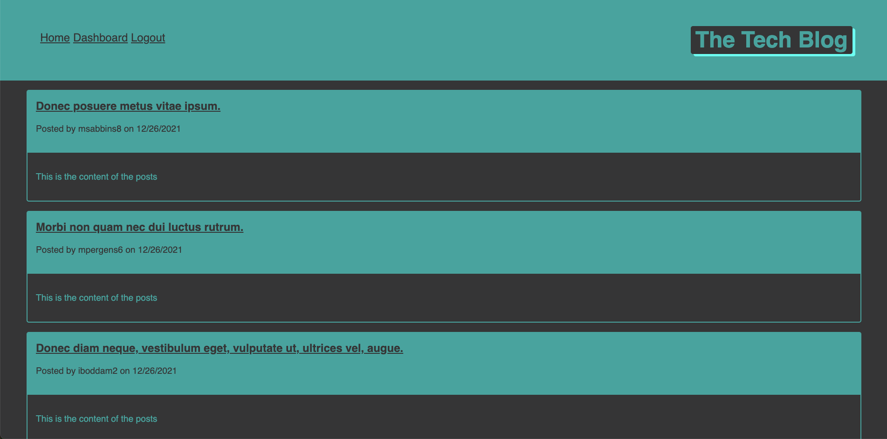
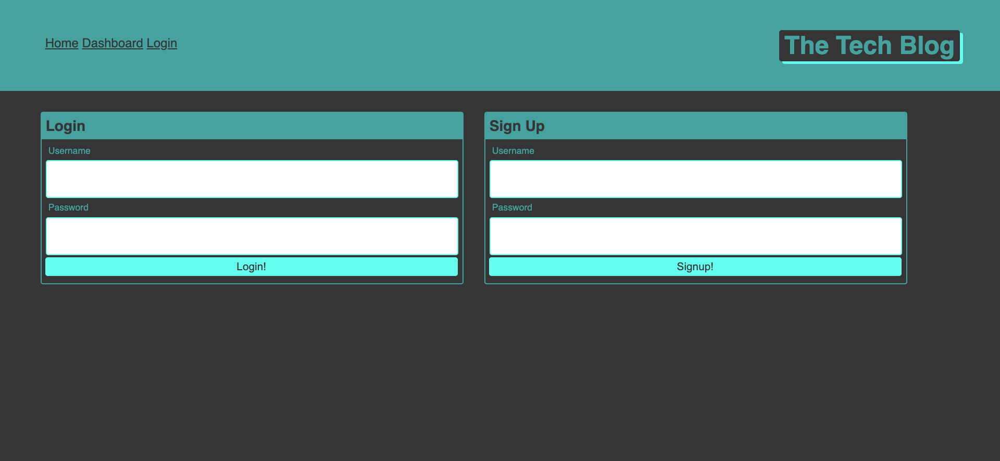
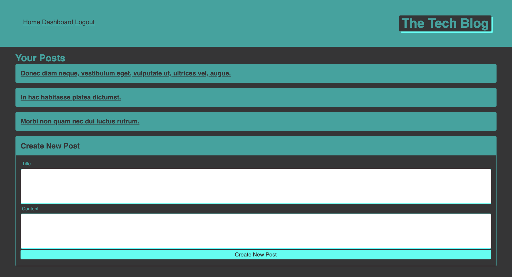
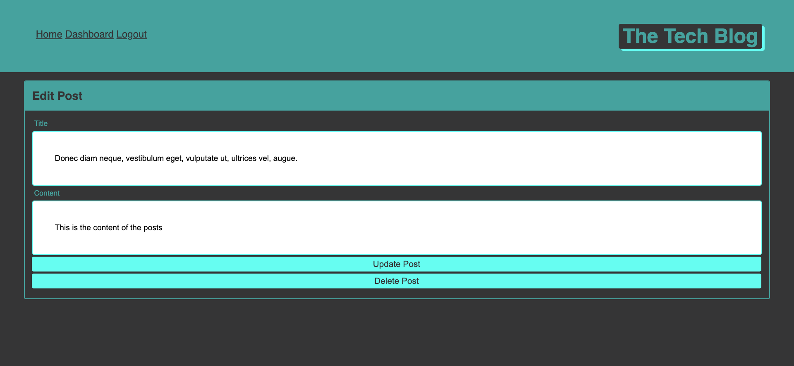

  # undefined

  
  
    

  ## Description

  A public blog where users can make posts for other users to comment on

  ## Table of Contents

  * [Demo](#demo)
  * [Installation](#installation)
  * [Usage](#usage)
  * [License](#license)
  * [Contributing](#contributing)
  * [Tests](#tests)
  * [Questions](#questions)

  
  ## Demo

  [Link to live application](https://thawing-eyrie-95452.herokuapp.com/)

  
  
  
  
  
  
  ## Installation

  To install necessary dependencies, run the following command:
    
    (npm i)

  
  ## Usage

  If you wish to seed the application then run command 

    (npm run seeds)

  
  ## License

  The application is covered under the following license:

  
  Info on License: [None](https://choosealicense.com/licenses/None)
    
  

  
  ## Contributing

  If you wish to contribute please contact me by email.

  
  ## Test

  To run tests, run the following command:
    
    (npm test)

  
  ## Questions

  If you have any questions about the repo, open an issue or contact me directly at [adamjfield@gmail.com](mailto:adamjfield@gmail.com) Source Han Sans). You can find more of my work at [undefined](https://github.com/undefined).
